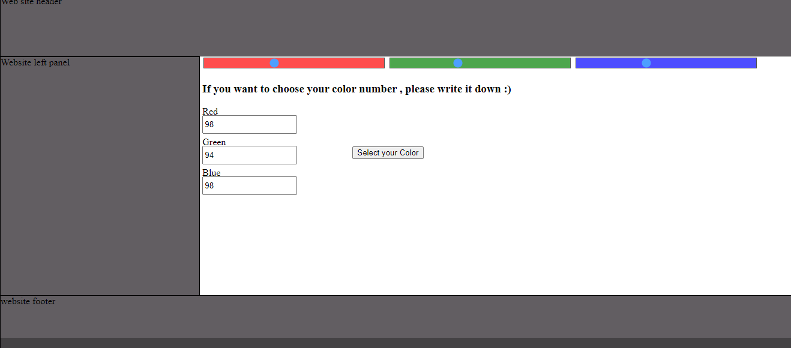

This was an assignment to make color picker with two ways:

1- write the number of each RGB.

2- Select each RGB from range input.

The page contins 3 areas (header, left sidebar and footer) which must take background with the selected color.

This is made in January 2019

live preview (https://raw.githack.com/AhmedAmin90/oldprojects-colorPicker/feature/colorPicker.html)
